# Assignment 02: AI-Powered Translation Plugin for Word Processing Applications

---

## 1. Introduction

In this assignment, I will designed an AI-powered translation plugin for seamless integration into Google Docs as an add-on. This tool empowers many individuals to improve their writing skills by translating text between multiple languages directly within the Google Docs interface. Leveraging advanced AI models, the add-on provides high-quality, context-aware translations with customizable settings tailored to academic, professional, or casual writing styles.

## 2. Key Features
### 2.1. Sidebar - Based User Interface

#### **Intuitive Layout** 

This dedicated sidebar allows users to set up translation parameters without leaving their document.

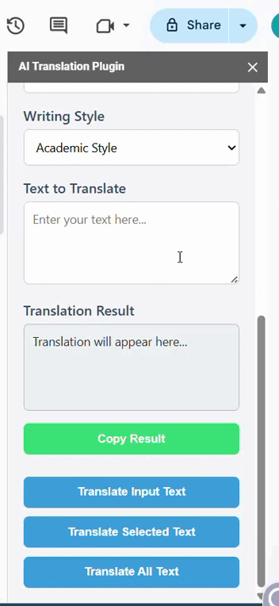

#### **Main Features** 

In this AI Translation's sidebar, users can
* Select the **source languages (input language)** and **target languages (desired translation output)** from a dropdown menu supporting a wide range of languages.
  
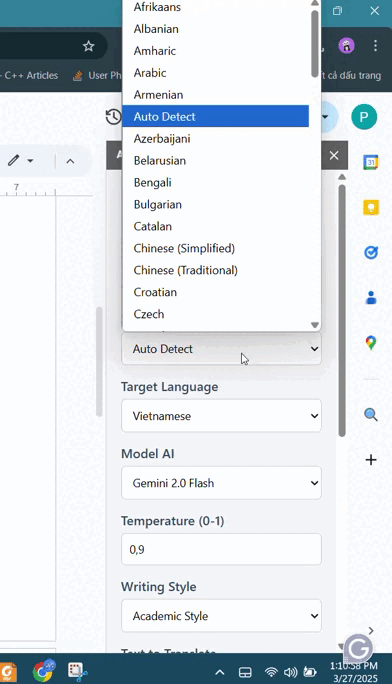

* Choose from **multiple AI models** to translate the provided text.

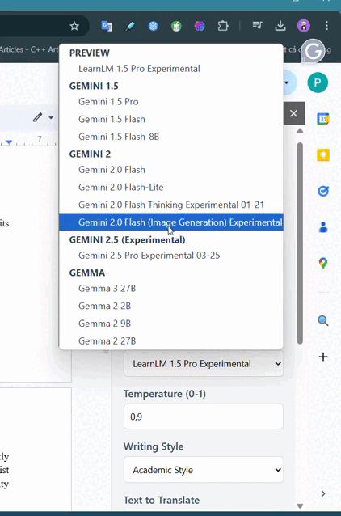

* Control **randomness** and **creativity** of the translation output by adjusting the **temperature** with the range of $0.0$ to $1.0$.
  
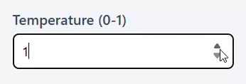

* Choose the **writing style** for the translation output, such as *academic*, *professional*, or *casual*.
  
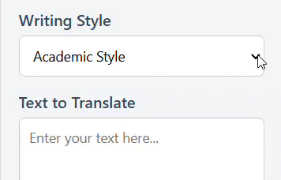

* Enter the provided text that users want to translate into the **"Text to Translate"** frame. 
  
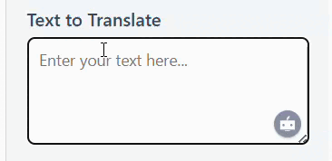

* View the translated output in the **"Translation Result"** frame.
  
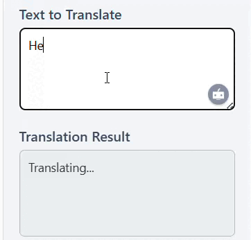

* Copy the translated text to the clipboard by clicking the **"Copy Result"** button.
  
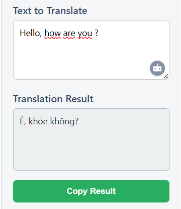

### 2.2. Models AI-Powered Translation

In this assignment, thanks to supporting various **Gemini** and **Gemma** models, the plugin can provide high-quality translations tailored to the user's writing style and context. The models include:
* **Preview model:** used for quick demonstrations and low-resource environments. It is suitable for rapid, basic translation tasks.
* **Gemini models:** are designed to provide high-quality translations with a focus on accuracy and fluency.
    * **Gemini 1.5 Series:** consists of Gemini 1.5 Pro, Gemini 1.5 Flash, and Gemini 1.5 Flash-8B
    * **Gemini 2.0 Series:** consists of Gemini 2.0 Flash Thinking Experimental 01-21, Gemini 2.0 Flash, Gemini 2.0 Flash-Lite, and Gemini 2.0 Flash (Image Generation) Experimental.
    * **Gemini 2.5 (Experimental):** is Gemini 2.5 Pro Experimental 03-25.
* **Gemma models:** is less powerful than Gemini models, but these models are efficient for translation need or offline scenarios. These models are Gemma 3 27B, Gemma 2 2B, Gemma 2 9B, and Gemma 2 27B.

Besides, the users can customize the translation result throughout the writing styles and temperature settings.

### 2.3. Real-Time Translation Assistance
#### **Translate Input Text**

This function allows users to enter text into the **"Text to Translate"** field and click the **"Translate Input Text"** button to receive the translated output in the **"Translation Result"** area. Additionally, the first time a user enters text, the translation result is generated automatically.


#### **Translate Selected Text**

This feature enables users highlight the text they want to translate and generate the translation output by clicking the **"Translate Selected Text"** button on the sidebar. Then, a **"Translation Selection"** dialog will appear on the top, displaying two side-by-side sections:
* **"Original Text"** gives information about the original text selected by the user in the initial document.
* **"Translated Text"** displays the translated result based on the selection options, including source languages, target languages, Models AI, temperature settings, and writing styles.

In addition, users have capabilities to choose to replace the original text with the translated result by clicking the **"Replace"** button below the two sections in the dialog. After that, a confirmation message will appear to indicate a successful replacement. The user simply needs to click **"OK"** button in this message to finish the progress. The translated one will be then inserted into the original document, replacing the original text and highlighted for emphasis. Otherwise, if the user does not wish to do this function, they just close the dialog.

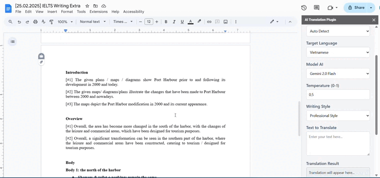

#### **Translate Entire Document**

This feature enables users translate whole document from source languages to target languages by clicking the **"Translate All Text"** button on the sidebar. As a result, the entire document will be translated and displayed at the bottom of the original content.

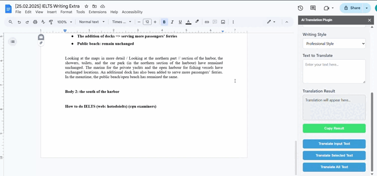

## 3. Installation & Deployment
### 3.1. Installation

**Step 1:** Download the file named **22127322.zip** on course moodle, or cloning the source code from project repository on GitHub by running the following command in the terminal:

```bash
git clone https://github.com/PhuocPhat1005/AI_Powered_Translation_Plugin_for_Word_Processing_Applications.git
```

**Step 2:** Create new project on Google Apps Script.
* Visit [Google Apps Script](https://script.google.com/home) and create a new standalone project.
* Create and copy all files in source, including `Code.gs`, `Sidebar.html`, and `MinimalDialog.html` into the project.

The detailed process is as follows:


**Step 3:** Configure OAuth Scopes & Manifest

Open `appsscript.json` on Google Apps Script and add required OAuth Scopes and URL Fetch Whitelist:

```json
{
  "timeZone": "Asia/Ho_Chi_Minh",
  "exceptionLogging": "STACKDRIVER",
  "runtimeVersion": "V8",
  "oauthScopes": [
    "https://www.googleapis.com/auth/documents.currentonly",
    "https://www.googleapis.com/auth/script.container.ui",
    "https://www.googleapis.com/auth/userinfo.email",
    "https://www.googleapis.com/auth/script.locale",
    "https://www.googleapis.com/auth/documents",
    "https://www.googleapis.com/auth/script.external_request"
  ],
  "urlFetchWhitelist": [
    "https://generativelanguage.googleapis.com/"
  ],
  "addOns": {
    "common": {
      "name": "AI Translation",
      "logoUrl": "https://img.icons8.com/color/2x/search",
      "useLocaleFromApp": true,
      "homepageTrigger": {
        "runFunction": "showSideBar"
      }
    },
    "docs": {
      "homepageTrigger": {
        "runFunction": "showSideBar"
      }
    }
  },
  "webapp": {
    "executeAs": "USER_ACCESSING",
    "access": "MYSELF"
  }
}
```

The detailed process is as follows:

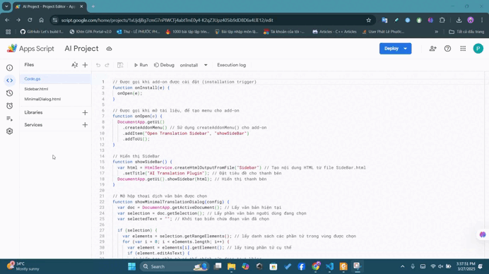


**Step 4:** Set `GEMINI_API_KEY` in this project

* In the Google Apps Script editor, go to **File > Project Settings > Script Properties**
* Click the "Add script property" button to add a new property:
  * **Key:** `GEMINI_API_KEY`
  * **Value:** `your_api_keys`

The detailed process is as follows:


### 3.2. Testing

* In the Apps Script editor, click on `Deploy` > `Test deployments`.
* Then, choosing `select type` > `Editor Add-on`.
* Then `Add Test` on `Editor Add-on` and select document to test.

The detailed process is as follows:


### 3.3. Deployment

* In the Apps Script editor, click on `Deploy` > `New deployment`
* Choose `select type` > `Add-on`.
* Choosing `User acessing the web app` and `Anyone with Google Account` on `Web app`.
* Click `Deploy` button.

The detailed process is as follows:

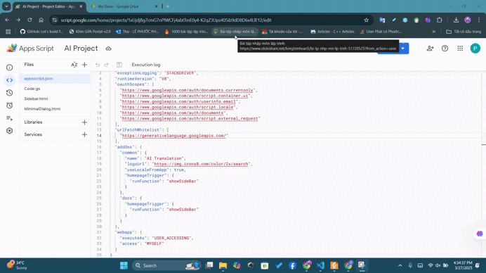
